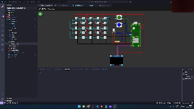

---

<table>
  <tr>
    <td>
      
    </td>
    <td>
      <h1>💡 Projeto: Comunicação Serial e Controle de LEDs com RP2040 e BitDogLab</h1>
    </td>
  </tr>
</table>

## 📋 Descrição Geral

Este projeto visa consolidar os conceitos de **comunicação serial** no microcontrolador **RP2040**, utilizando a placa de desenvolvimento **BitDogLab**. O objetivo principal é implementar a comunicação via **UART** e **I2C**, interagindo com diversos componentes como **LEDs comuns**, **LEDs WS2812**, **display SSD1306** e **botões**. O projeto também aborda o tratamento de **interrupções** e o debouncing dos botões, além do envio de informações para o Serial Monitor.

---

## 🎯 Objetivos

- **Comunicação Serial:** Aplicar a comunicação serial (UART) e I2C em microcontroladores.
- **Controle de LEDs:** Manipular LEDs comuns e endereçáveis WS2812.
- **Interrupções e Debouncing:** Utilizar interrupções (IRQ) e debouncing no tratamento das entradas dos botões.
- **Exibição no Display:** Trabalhar com o display SSD1306 via I2C para exibir informações.
- **Envio de Dados via UART:** Enviar dados ao Serial Monitor por meio da comunicação UART.

---

## 🛠 Componentes Utilizados

- **Matriz 5x5 de LEDs WS2812 (endereçáveis):**
  - **GPIO:** Conectada à GPIO 7.
  - **Função:** Exibe números de 0 a 9 com efeitos visuais.
- **LED RGB Comum:**
  - **GPIOs:** Conectado às GPIOs 11 (verde), 12 (azul) e 13 (vermelho).
  - **Função:** Os LEDs verde e azul são controlados pelos botões.
- **Botão A:**
  - **GPIO:** Conectado à GPIO 5.
  - **Função:** Alterna o estado do LED RGB Verde e exibe mensagem no display e no Serial Monitor.
- **Botão B:**
  - **GPIO:** Conectado à GPIO 6.
  - **Função:** Alterna o estado do LED RGB Azul e exibe mensagem no display e no Serial Monitor.
- **Display SSD1306:**
  - **Conexões I2C:** GPIO 14 (SDA) e GPIO 15 (SCL).
  - **Função:** Exibe caracteres e números enviados via Serial Monitor.

---

## 🗂 Estrutura do Projeto

```plaintext
ComunicacaoSerialRP2040/
├── assets
│   ├── logo.jpeg
│   ├── placa.gif
│   └── wokwi.gif
├── generated
│   └── ws2812.pio.h      # Gerado automaticamente pelo CMake
├── include
│   ├── botoes.h
│   ├── font.h
│   ├── leds.h
│   └── ssd1306.h
├── src
│   ├── botoes.c
│   ├── leds.c
│   ├── main.c
│   └── ssd1306.c
├── wokwi
│   ├── diagram.json
│   └── wokwi.toml
├── .gitignore
├── CMakeLists.txt
├── LICENSE
├── pico_sdk_import.cmake
└── README.md

```
> _Observação:_ O arquivo font e a biblioteca ssd1306 foi adaptado a partir do repositório do professor [Wilton Lacerda Silva](https://github.com/wiltonlacerda) e modificado para esta atividade.
---

## 🚀 Funcionalidades do Projeto

1. **Personalização da Fonte (`font.h`):**
   - Adição de caracteres minúsculos e criação de glifos personalizados.

2. **Entrada de Caracteres via PC:**
   - O Serial Monitor permite que o usuário envie caracteres para o microcontrolador.
   - Quando um número de 0 a 9 é digitado, o padrão correspondente é exibido na matriz WS2812 e no display SSD1306.

3. **Interação com o Botão A:**
   - Pressionar o Botão A alterna o estado do LED RGB Verde.
   - O estado do LED é exibido no display SSD1306 e também enviado para o Serial Monitor.

4. **Interação com o Botão B:**
   - Pressionar o Botão B alterna o estado do LED RGB Azul.
   - O estado do LED é exibido no display SSD1306 e também enviado para o Serial Monitor.

---

## 🔧 Requisitos Técnicos

- **Interrupções (IRQ):** Os botões utilizam interrupções para garantir respostas rápidas.
- **Debouncing:** Implementação do debouncing para leituras precisas dos botões.
- **Controle de LEDs:** Manipulação de LEDs comuns e endereçáveis (WS2812) com efeitos visuais.
- **Display SSD1306:** Utilização do display via I2C para exibir informações.
- **Comunicação UART:** Envio de dados ao Serial Monitor.
- **Organização do Código:** Estrutura modularizada com nomes e comentários em português.

---

## ⚙️ Instalação e Execução

### 1. Configuração do Ambiente

- Certifique-se de que o [Pico SDK](https://datasheets.raspberrypi.com/pico/getting-started-with-pico.pdf) esteja instalado e configurado corretamente.
- Verifique se todas as dependências necessárias estão instaladas.

### 2. Clonando o Repositório

Clone o repositório para sua máquina:

```bash
git clone https://github.com/otilianojunior/comunicacaoserialrp2040.git

```

### 3. Compilação e Envio do Código

No VS Code, com o ambiente do Pico SDK configurado, execute:

```bash
mkdir build
cd build
cmake ..
make
```

Após a compilação, copie o arquivo `.uf2` gerado para o Raspberry Pi Pico (certifique-se de que a placa esteja no modo bootloader).

### 4. Testes

- **Simulação no Wokwi:**  
  Utilize a plataforma [Wokwi](https://wokwi.com/) para testar o código.

  <p align="center">
  
  </p>

- **Execução na Placa RP2040 - BitDogLab:**  
  <p align="center">
  
  </p>

---

---

## 📁 Entregáveis

- Código-fonte completo neste repositório.
- Vídeo demonstrativo: [Vídeo](https://drive.google.com/file/d/1rFEsG3iJb4y7KoF4MZ1ZvB4IzL8XVy5H/view?usp=sharing)

---

## ✅ Conclusão

Este projeto oferece uma oportunidade prática de aplicar os conceitos de comunicação serial, controle de LEDs, interrupções e debouncing em sistemas embarcados. Ao final, você terá um entendimento aprofundado da interação entre hardware e software em microcontroladores.

---

_Desenvolvido por Otiliano Junior_

--- 
